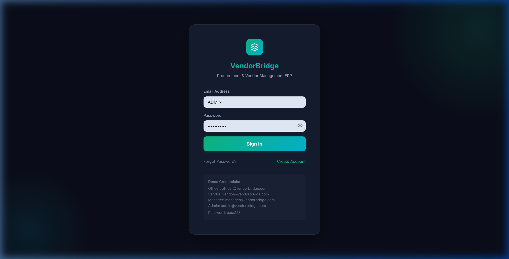
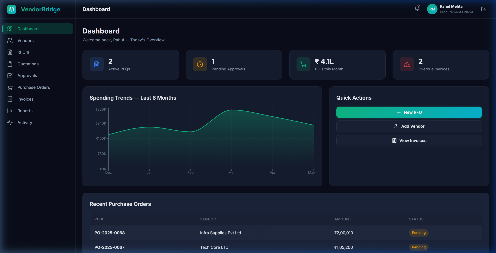
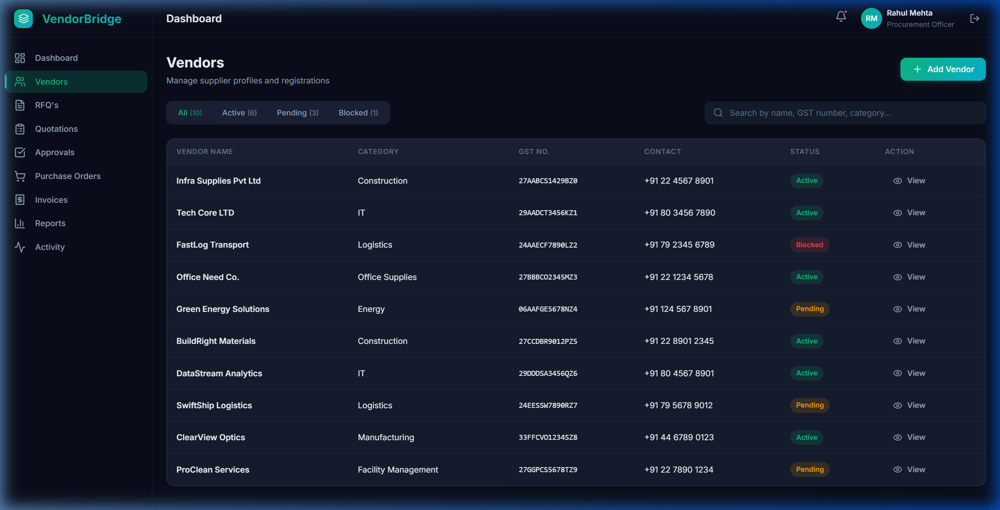
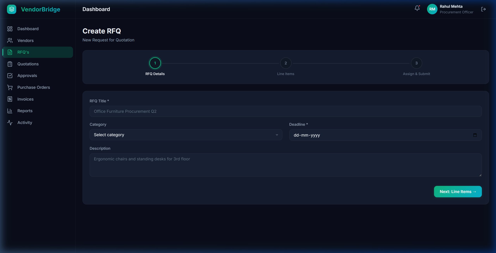
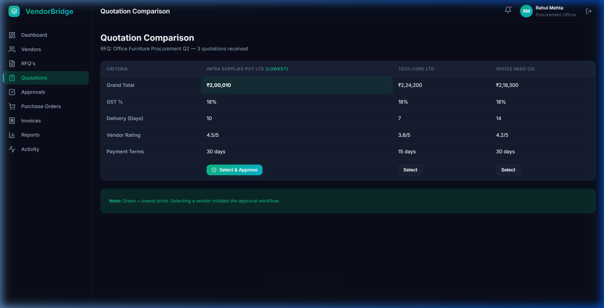
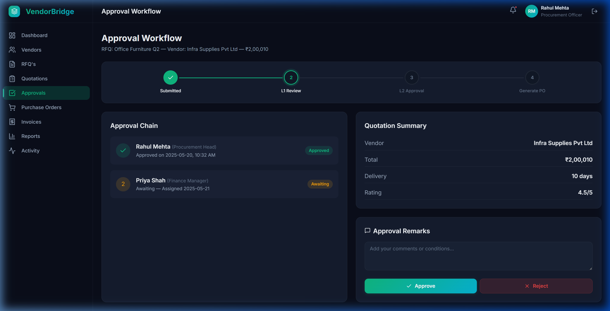
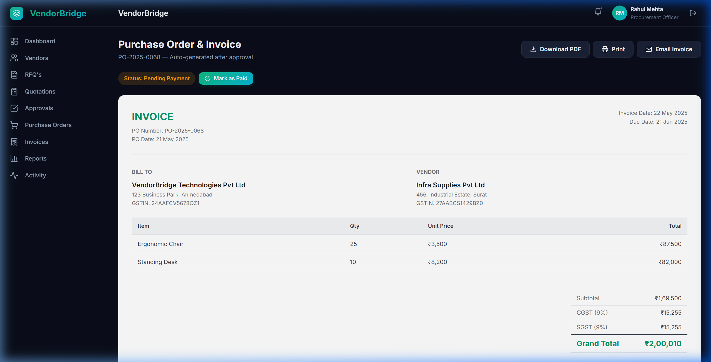
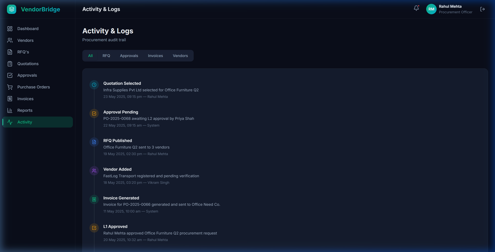
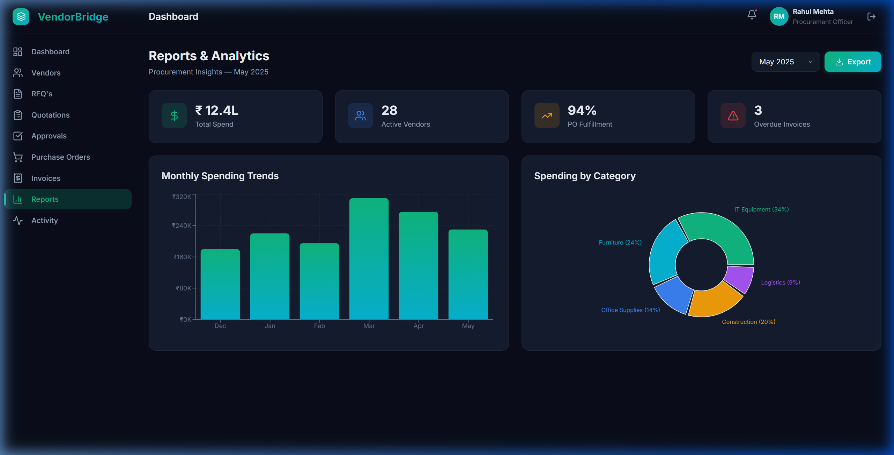

# VendorBridge — Enterprise Vendor & Procurement Management Portal

VendorBridge is a modern, high-performance, glassmorphic SaaS portal designed to streamline the enterprise procurement lifecycle. It bridges the gap between organization requesters, procurement managers, vendors, and finance approvers.

The application is built using **React + Vite**, styled with a customized **Vanilla CSS design system**, and powered by a centralized local state repository (with role-based simulated sessions and complete CRUD flows).

---

## 📸 Core Pages & Walkthrough

### 🔐 1. Authentication Portal
Every role accesses their customized workstation via a central login interface. Demo credentials are dynamically pre-loaded for ease of testing.
* **Demonstration**: User logs in with `officer@vendorbridge.com` or `vendor@vendorbridge.com` to test customized dashboards.
* **File Location**: [LoginPage.jsx](file:///c:/Users/ROG%20Strix/Desktop/LEARNING/PROJECTS/VendorBridge/src/pages/LoginPage.jsx)



---

### 📊 2. Dynamic Command Dashboard
The dashboard displays high-priority cards, analytics trends, and pending tasks tailored to the active user role.
* **Recharts Visualizations**: Features a dynamic *Spend Trend* area chart showing 6-month cycles.
* **Interactive List**: Recent Purchase Orders are listed with status indicator badges.
* **File Location**: [DashboardPage.jsx](file:///c:/Users/ROG%20Strix/Desktop/LEARNING/PROJECTS/VendorBridge/src/pages/DashboardPage.jsx)



---

### 🏢 3. Vendor Directory
The vendor directory provides sorting, search filters, and status categorization (All, Active, Pending, Blocked).
* **Modal Operations**: Includes an "Add Vendor" form wizard capturing GST registration numbers, contacts, and categories.
* **File Location**: [VendorsPage.jsx](file:///c:/Users/ROG%20Strix/Desktop/LEARNING/PROJECTS/VendorBridge/src/pages/VendorsPage.jsx)



---

### 📝 4. Request for Quotation (RFQ) 3-Step Wizard
Allows procurement managers to create and dispatch new bid requests.
* **Step 1: Details**: Title, category, deadline date, and description.
* **Step 2: Line Items**: Dynamic row adder/remover for items, quantities, and units.
* **Step 3: Assignments**: Assign specific vendors to receive the RFQ.
* **File Location**: [CreateRFQPage.jsx](file:///c:/Users/ROG%20Strix/Desktop/LEARNING/PROJECTS/VendorBridge/src/pages/CreateRFQPage.jsx)



---

### 🤝 5. Side-by-Side Quotation Comparison Portal
Allows procurement officers to analyze incoming vendor bids.
* **Smart Cost Highlighting**: Dynamically highlights the lowest-priced line items in green.
* **Bid Awarding**: Select the winning bid to trigger the purchase order draft stage.
* **File Location**: [QuotationComparisonPage.jsx](file:///c:/Users/ROG%20Strix/Desktop/LEARNING/PROJECTS/VendorBridge/src/pages/QuotationComparisonPage.jsx)



---

### ✍️ 6. Approval Chain Workflow
RFQs, Purchase Orders, and Invoice payments must progress through L1/L2 approval verification.
* **Drawer Review**: A sliding panel presents line items and history trails.
* **Actions**: One-click approval or rejection with mandatory remark comments.
* **File Location**: [ApprovalWorkflowPage.jsx](file:///c:/Users/ROG%20Strix/Desktop/LEARNING/PROJECTS/VendorBridge/src/pages/ApprovalWorkflowPage.jsx)



---

### 📄 7. Purchase Order & Invoice Detail (with PDF Export)
Generates print-ready billing documents.
* **Export Utilities**: Integrates `html2pdf.js` to download official POs and invoices as PDFs.
* **Print Stylesheet**: Built-in CSS prints invoices cleanly without UI headers or sidebars.
* **File Location**: [POInvoicePage.jsx](file:///c:/Users/ROG%20Strix/Desktop/LEARNING/PROJECTS/VendorBridge/src/pages/POInvoicePage.jsx)



---

### 📋 8. Immutable System Audit Logs
Every system transaction, bid submission, and approval is recorded in an append-only timeline.
* **Filters**: View logs by RFQ, Approvals, Invoices, or User activity.
* **File Location**: [ActivityLogsPage.jsx](file:///c:/Users/ROG%20Strix/Desktop/LEARNING/PROJECTS/VendorBridge/src/pages/ActivityLogsPage.jsx)



---

### 📈 9. Analytics & Procurement Reports
High-level operational stats on total spend, fulfillment rates, and department budgets.
* **Visualizations**: Features *Spend by Category* pie charts and *Fulfillment* stats.
* **File Location**: [ReportsPage.jsx](file:///c:/Users/ROG%20Strix/Desktop/LEARNING/PROJECTS/VendorBridge/src/pages/ReportsPage.jsx)



---

## 🛠️ Technology Stack

- **Core**: React 18, Vite
- **Routing**: React Router DOM (v6)
- **Charts**: Recharts
- **Icons**: Lucide React
- **PDF Generation**: html2pdf.js
- **Styling**: Vanilla CSS with customized variable mappings for dark mode glassmorphism (`backdrop-filter`).

---

## 📂 Project Structure

```text
VendorBridge/
├── docs/
│   └── screenshots/         # Walkthrough screenshots
├── public/                  # Static assets & SVG icons
├── src/
│   ├── context/
│   │   ├── AuthContext.jsx      # Session management & roles
│   │   ├── AppDataContext.jsx   # Core CRUD state reducer (RFQs, POs, etc.)
│   │   └── ToastContext.jsx     # Global feedback alerts
│   ├── pages/               # Application page components
│   ├── utils/
│   │   ├── mockData.js          # Mock ERP initial database
│   │   └── formatters.js        # Formatting utilities
│   ├── App.jsx              # Main routing & guards
│   ├── index.css            # Base design system
│   └── main.jsx             # React entrypoint
├── Dockerfile               # Multi-stage Docker config for Render/Railway
└── nginx.conf               # Nginx server configuration
```

---

## 💻 Local Development Setup

### Prerequisites
- Node.js (v18+)
- npm (v9+)

### Installation & Launch
1. Clone the repository:
   ```bash
   git clone https://github.com/Digvijay05/VendorBridge.git
   cd VendorBridge
   ```

2. Install dependencies:
   ```bash
   npm install
   ```

3. Run the development server:
   ```bash
   npm run dev
   ```
   Open your browser and navigate to `http://localhost:5173`.

---

## 🐳 Docker Deployment

The project is configured with a production-optimized multi-stage Docker build to package static assets and serve them with fallbacks.

### Running locally with Docker:
```bash
# Build the image
docker build -t vendorbridge:latest .

# Run the container
docker run -d -p 3000:3000 --name vendorbridge vendorbridge:latest
```

---

## 🔐 Demo Accounts
Sign in with the password `pass123` to test role-specific functionalities:

| Role | Email |
|------|-------|
| **Procurement Officer** | `officer@vendorbridge.com` |
| **Vendor Representative** | `vendor@vendorbridge.com` |
| **Finance Manager / Approver** | `manager@vendorbridge.com` |
| **System Administrator** | `admin@vendorbridge.com` |
